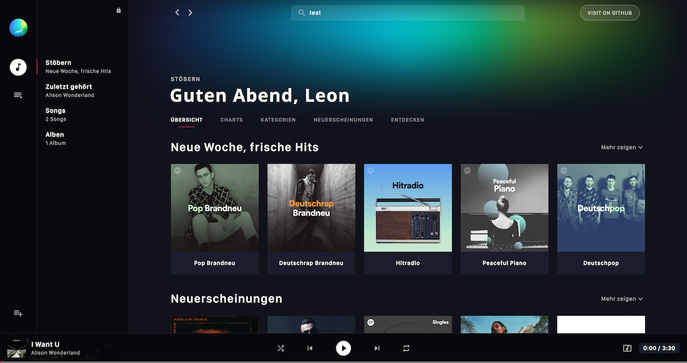

# music-app

> Music-Streaming app built with Webpack, Vue.js, Vuex and the Spotify API.



## How to setup dev environment

``` bash
# clone this repository
git clone http://git.microeinhundert.com/personal-projects/music-app

# go into project folder
cd music-app

# install dependencies
npm i

# serve with hot reload at localhost:8080
npm run serve

# run with electron
npm run electron

# build for production with minification
npm run build
```
